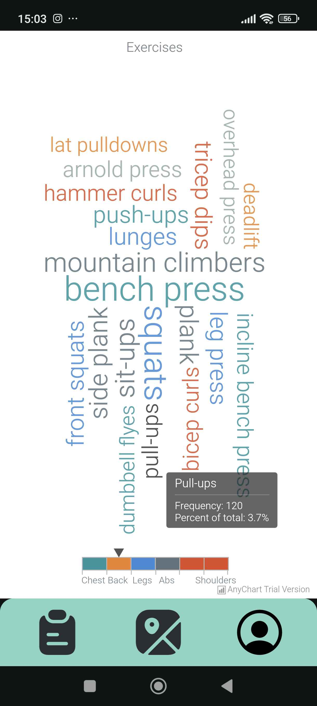
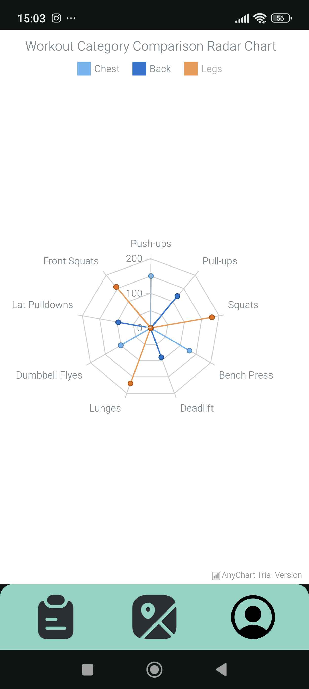
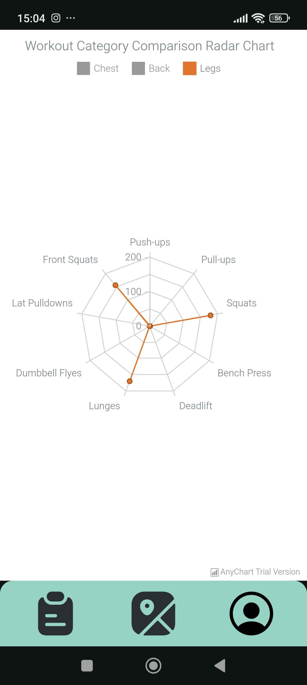
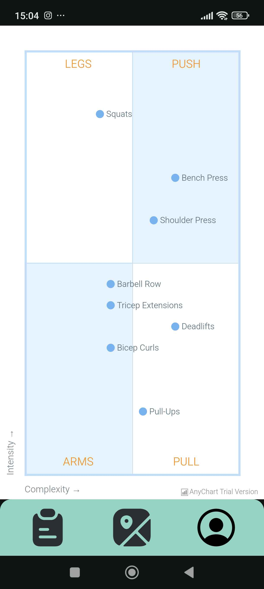

# AnyChartSample

# Zakaj

AnyChart Android Chart je knjižnica za vizualizacijo podatkov za
preprosto ustvarjanje interaktivnih grafikonov v aplikacijah za Android.
Deluje na API-ju 19+ (Android 4.4) in ima na desetine vgrajenih vrst grafikonov.

# Prednosti

- Enostavna uporaba
- Podpira več vrst grafikonov
- Podpira interaktivne funkcije

# Slabosti

- Zadnja sprememba pred enim letom

# Licenca

[© AnyChart.com - JavaScript charts](https://www.anychart.com/)

# Število zvezdic, sledilcev, forkov


# Vzdrževanje projekta

Projekt je bil nazadnje posodobljen pred enim letom.


# Primeri uporabe

## Tag Cloud

```kt
val tagCloud = AnyChart.tagCloud()
tagCloud.title("Exercises")

val ordinalColor = OrdinalColor.instantiate()
ordinalColor.colors(
    arrayOf(
        "#26959f", "#f18126", "#3b8ad8", "#60727b", "#e24b26"
    )
)
tagCloud.colorScale(ordinalColor)
tagCloud.angles(arrayOf(-90.0, 0.0, 90.0))

tagCloud.colorRange().enabled(true)
tagCloud.colorRange().colorLineSize(15.0)

val data: MutableList<DataEntry> = ArrayList()
data.add(CategoryValueDataEntry("Push-ups", "Chest", 150))
data.add(CategoryValueDataEntry("Pull-ups", "Back", 120))
data.add(CategoryValueDataEntry("Squats", "Legs", 300))
data.add(CategoryValueDataEntry("Plank", "Abs", 200))
data.add(CategoryValueDataEntry("Bicep Curls", "Arms", 140))
data.add(CategoryValueDataEntry("Overhead Press", "Shoulders", 110))
data.add(CategoryValueDataEntry("Deadlift", "Back", 90))
data.add(CategoryValueDataEntry("Bench Press", "Chest", 330))
data.add(CategoryValueDataEntry("Lunges", "Legs", 170))
data.add(CategoryValueDataEntry("Sit-ups", "Abs", 220))
data.add(CategoryValueDataEntry("Dumbbell Flyes", "Chest", 100))
data.add(CategoryValueDataEntry("Tricep Dips", "Arms", 145))
data.add(CategoryValueDataEntry("Lat Pulldowns", "Back", 95))
data.add(CategoryValueDataEntry("Leg Press", "Legs", 160))
data.add(CategoryValueDataEntry("Side Plank", "Abs", 180))
data.add(CategoryValueDataEntry("Arnold Press", "Shoulders", 115))
data.add(CategoryValueDataEntry("Hammer Curls", "Arms", 135))
data.add(CategoryValueDataEntry("Incline Bench Press", "Chest", 125))
data.add(CategoryValueDataEntry("Front Squats", "Legs", 155))
data.add(CategoryValueDataEntry("Mountain Climbers", "Abs", 210))

tagCloud.data(data)
```

<div style="display: flex; gap: 1rem">
    
    
</div>

## Radar

```kt
val radar = AnyChart.radar()
radar.title("Workout Category Comparison Radar Chart")

// Configure Y-axis scale
radar.yScale().minimum(0.0)
radar.yScale().minimumGap(0.0)
radar.yScale().ticks().interval(50.0)
radar.xAxis().labels().padding(5.0, 5.0, 5.0, 5.0)

// Configure legend
radar.legend()
    .align(Align.CENTER)
    .enabled(true)

// Create the workout data
val data: MutableList<DataEntry> = ArrayList()
data.add(RadarDataEntry("Push-ups", 150, 0, 0)) // Chest
data.add(RadarDataEntry("Pull-ups", 0, 120, 0)) // Back
data.add(RadarDataEntry("Squats", 0, 0, 180)) // Legs
data.add(RadarDataEntry("Bench Press", 130, 0, 0)) // Chest
data.add(RadarDataEntry("Deadlift", 0, 90, 0)) // Back
data.add(RadarDataEntry("Lunges", 0, 0, 170)) // Legs
data.add(RadarDataEntry("Dumbbell Flyes", 100, 0, 0)) // Chest
data.add(RadarDataEntry("Lat Pulldowns", 0, 95, 0)) // Back
data.add(RadarDataEntry("Front Squats", 0, 0, 155)) // Legs


// Map the data for the radar chart
val set = com.anychart.data.Set.instantiate().data(data)
val chestData: Mapping = set.mapAs("{ x: 'x', value: 'value' }")
val backData: Mapping = set.mapAs("{ x: 'x', value: 'value2' }")
val legsData: Mapping = set.mapAs("{ x: 'x', value: 'value3' }")

// Configure the lines for each category
val chestLine: Line = radar.line(chestData)
chestLine.name("Chest")
chestLine.markers()
    .enabled(true)
    .type(MarkerType.CIRCLE)
    .size(3.0)

val backLine: Line = radar.line(backData)
backLine.name("Back")
backLine.markers()
    .enabled(true)
    .type(MarkerType.CIRCLE)
    .size(3.0)

val legsLine: Line = radar.line(legsData)
legsLine.name("Legs")
legsLine.markers()
    .enabled(true)
    .type(MarkerType.CIRCLE)
    .size(3.0)

// Configure tooltip
radar.tooltip().format("Value: {%Value}")
```

<div style="display: flex; gap: 1rem">
    
    
</div>

## Quadrant

```kt
val quadrant = AnyChart.quadrant()

quadrant.padding(35.0, 35.0, 35.0, 35.0)

val data: MutableList<DataEntry> = ArrayList()
data.add(QuadrantDataEntry(70, 70, "Bench Press")) // Push
data.add(QuadrantDataEntry(60, 60, "Shoulder Press")) // Push
data.add(QuadrantDataEntry(55, 15, "Pull-Ups")) // Pull
data.add(QuadrantDataEntry(40, 45, "Barbell Row")) // Pull
data.add(QuadrantDataEntry(35, 85, "Squats")) // Legs
data.add(QuadrantDataEntry(70, 35, "Deadlifts")) // Legs
data.add(QuadrantDataEntry(40, 30, "Bicep Curls")) // Arms
data.add(QuadrantDataEntry(40, 40, "Tricep Extensions")) // Arms

val marker: Marker = quadrant.marker(data)
marker.labels()
    .enabled(true)
    .fontFamily("Arial")
    .fontColor("#546e7a")
marker.labels()
    .position("right")
    .anchor(Anchor.LEFT_CENTER)
    .offsetX(5.0)
    .offsetY(0.0)
    .format("{%Name}")
marker.tooltip(false)

quadrant.quarters(
    """{
  rightTop: {
    title: {
      text: 'PUSH',
      fontColor: '#ff8f00',
      padding: 10
    }
  },
  rightBottom: {
    title: {
      text: 'PULL',
      fontColor: '#ff8f00',
      padding: 10
    }
  },
  leftTop: {
    title: {
      text: 'LEGS',
      fontColor: '#ff8f00',
      padding: 10
    }
  },
  leftBottom: {
    title: {
      text: 'ARMS',
      fontColor: '#ff8f00',
      padding: 10
    }
  }
}"""
)

var label = quadrant.quarters().leftBottom().label(0.0)
label.enabled(true)
label.useHtml(true)
label.position(Position.LEFT_BOTTOM)
label.anchor(Anchor.LEFT_CENTER)

label.offsetX(-20.0)
label.text("Intensity &#8594;")
label.rotation(-90.0)

label = quadrant.quarters().leftBottom().label(1.0)
label.enabled(true)
label.useHtml(true)
label.position(Position.LEFT_BOTTOM)
label.anchor(Anchor.LEFT_CENTER)
label.offsetY(20.0)
label.text("Complexity &#8594;")
```

